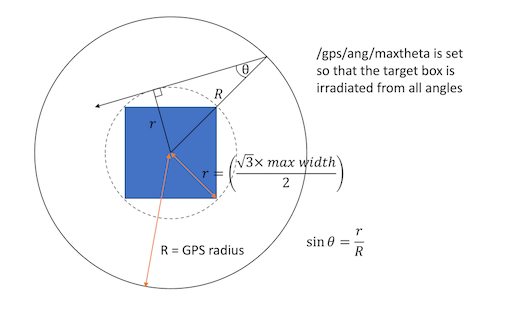

# DNA Damage simulation

DNA damage simulation using Geant4. DNA damage is calculated on a voxel representing a section of the cell nucleus, this is defined by the [DNA geometry](#dna-geometry) ([./geometryFiles](./geometryFiles)). The DNA damage simulation can be calculated from a [particle source](#simulation) ([./simulation](./simulation/)) or from a [Co-60 photon source](#photon-simulation) ([./photon_simulation](./photon_simulation/)). The output of the DNA damage simulation is a root file containing the energy depositions close to the DNA and the radical interactions with the deoxyribose molecules. From this output the DNA damage can be calculated. The [clustering](#clustering) algorithm ([./Clustering](./Clustering)) calculates the clusters of DNA strand breaks (e.g. DSB). A particle source can be compared to the Co-60 reference source by calculating the radiobiological effectiveness (RBE).

- Setup instructions are given in the individual components below.
- A test set is provided to check setup and ensure simulation output is as expected. See separate [README](./testSet/README.md) in the testSet directory.
- For examples on how to run simulations see [alpha particle example](#example-of-how-to-run-an-alpha-simulation) and [Co60 example](#example-of-how-to-run-a-co60-simulation)

## DNA Geometry

A DNA geometry is required for the DNA damage simulation. Two options for defining the DNA are used in this simulation: simple and continuous.

### Simple Geometry
Simple geometry with short segments of chromatin fibre is created with [writeSimpleGeometry.py](./geometryFiles/writeSimpleGeometry.py).
* Number of strands can be changed with numRows and numColumns
* Nucleus size can be changed by changing volumeWidth, the chromatin height is fixed at 300nm.
* For clustering use continuous=False, this stops complex damage being counted between strands.

### Continuous Geometry

Continuous geometry can created with  [writeContinuousGeometry.py](./geometryFiles/writeContinuousGeometry.py). This uses fractaldna to create continuous strand of chromatin fibre from voxels of either straight turned or turned and twisted segments of chromatin fibre. The voxels can be placed along any path. There are three types:
1) Fractal
    * The path along which the voxels are placed is created using a fractal pattern, using the functions in fractaldna. The nucleus size depends on the voxel size and number of fractals.
2) From file
    * The paths along which the voxels are placed is read from a .csv file (see exampleInput.csv for format). The step between adjacent points must be 1.0 because of the use of fractaldna functions. The nucleus size depends on the voxel size and the number of points in the path.
3) Cell cycle
    * Used to create geometries to represent different phases in the cell cycle.
    * "interphase" creates two geometry files using a supplied path file. The first contains one set of DNA. The second contains two sets of DNA (the same path duplicated and shifted to avoid overlap), this represents the two copies of DNA created in the S phase.
    * "mitosis" creates a condensed path to model the mitosis phase of the cell cycle, two sets of DNA are placed in this condensed path shifted to avoid overlap. The condensed path is created by simpleMitosis.py. The volume of the condensed volume is calculated to match the density required for a chromosome.

For the continuous geometry the nucleus is a cube and the continuous=True should be used.

Make sure that for the parameters chosen there are no overlaps particularly for the turned segments.

## Simulation 
Geant4 simulation of the DNA damage due to alpha-particles, protons or electrons. Energy deposits and OH reactions are scored from the simulation.

Inputs to the simulation are:
1) A [DNA geometry](#dna-geometry)
2) Either a Geant4 input file describing the particle source or a pre-calculated phase space file for example from the [photon simulation](#photon-simulation)

 ### Initial Setup on Blue Pebble
 * cd to DNA_damage/simulation
 * make a build directory and cd to it
 * run the following to compile:
```
 
module add cmake/3.27.9
module add gcc/12.3.0
module add geant4/11.1.3

cmake -DCMAKE_C_COMPILER=/software/spack/linux-rocky8-broadwell/gcc-12.3.0/gcc-12.3.0-sknc/bin/gcc -DCMAKE_CXX_COMPILER=/software/spack/linux-rocky8-broadwell/gcc-12.3.0/gcc-12.3.0-sknc/bin/g++ ..
make -j8
```

Repeat for the photon_simulaiton directory if running Co60 simulations.

 ### Description of commandline options and input file

run with ./rbe and options as required:
 - -out filename - to output a root file
 - -ref - to use the reference geometry for photon beams with 2mm build up, corresponding input file is Co60.in
 - -seed - to set the seed
 - -gui - for visualisation (quicker with -chemOFF)
 - -chemOFF - to run without chemistry
 - -sugar - specify binary file containing deoxyribose positions
 - -histone - specify binary file containing histone positions
 - -decayPS - phase space file from decay simulation (see associated repo)
 - -photonPS - phase space file from photon simulation

Geometry is determined by the -sugar and -histone files which describe the positions of the deoxyribose, bases and histones. These are created by writeSimpleGeometry.py. The volume width can be adjusted using volumeWidth and the number of chromatin fibre segments placed with numRows and numColumns - these are spaced uniformly given the volume width. Check there are no overlaps when running the simulation.

The input file can be changed to change the simulation parameters
 - /det/setSize - should match that set for the geometry files
 - /run/numberOfThreads - sets number of threads
 - /gps/particle -  must be alpha, proton, e-
 - /gps/ene/mono - sets the energy of the primaries
 - /gps/pos/.. - can be used to change the distribution of the source
 - /gps/ang/maxtheta - should be set to an angle large enough to cover the whole target box e.g. see below for an example.
 - /scheduler/endTime - the time limit for the radiolysis simulation
 - /run/beamOn - the number of primaries



## Photon simulation 
The photon simulation calculates the DNA damage due to a reference radiation source (Co-60 photons). This simulation is separate to the [particle simulation](#simulation) to make the simulation more efficient. Due to the low cross section for photons the calculation time is much longer. Therefore the photon simulation is split into two parts. In addition, the radius of the origin of the photons is increased to 5 mm to ensure charged particle equilibrium.

1) Photon interactions with a box the same size as the DNA voxel are simulated. Secondary electrons entering the box are recorded in a phase space file. This phase space file contains the locations, energy and direction of the secondary electrons.
2) The [particle simulation](#simulation) is then run using the phase space file as the input.

[Set up](#initial-etup-on-blue-pebble) is the same as for the particle simulation.

See the [Co60 example](#example-of-how-to-run-a-co60-simulation) for how to run a photon simulation.


## Clustering 
The clustering analyses energy depositions and OH reactions from the simulation to calculate the number of strand breaks and number of strand break clusters (e.g DSB). 

- Direct damage is calculated using the linear threshold model, (default min = 5 eV, max = 37.5 eV)
- Indirect damage is calculated assuming OH reactions with the deoxyribose molecule have the potential to lead to strand breaks. A percentage probability that this reaction causes a strand break is set (default 40.5%).
- The clustering algorithm can be run on outputs of the standalone simulation REF simulation, a photon simulation REF photon simulation or a decay simulation (see associated repo).
- Definitions of strand break types are based on Nikjoo et al Int J Radiat Biol. 1997 May;71(5):467-83.  doi: 10.1080/095530097143798.
- Clustering algorithm is based on Geant4 example 'clustering'. Changes have been made to include indirect damage, calculate clusters based on sugar molecule index calculations have been added including DSB cluster size, separating damage into direct, indirect, mixed, hybrid and total and DSB distance.

The clustering is a multistage process:
1) The output from the Geant4 simulation is used to calculates how many strand breaks there are from direct and indirect effects and the location of each (in base pair index).
2) The individual strand break locations are used to calculate whether they form clusters of damage (SSB, cSSB, DSB etc). 
3) Two files are produced:
    -  Number of individual strand breaks, simple single strand breaks (SSB), complex single strand breaks (cSSB) and DSB. Considering direct damage and indirect damage independently and combined (called total).
    - Further analysis of DSB breaks, number of strand breaks per cluster and distance between DSB clusters are calculated. Here direct and indirect effects both contribute to the formation of DSB. The types of DSB are direct, indirect, mixed, hybrid and total. 
4) Metrics (e.g. number of DSB per Gy per Gbp) can be calculated using the functions defined in [readResults.py](./Clustering/readResults.py)

[Unit tests](./Clustering/test_runClustering.py) are provided to ensure that the clustering algorithm is functioning as expected. 

 ### How to run

The full clustering process can be run from REF run.py, the following arguments can be supplied:
 - --filename: Output of simulation (root file) to run clustering on
 - --filenamePhoton: If running a photon simulation two root files are needed as the simulation is 2 part 
 - --output: output file name"
 - --min: Emin direct damage, default 5eV
 - --max: Emax direct damage, default 37.5eV
 - --indirect: Indirect damage probability, default 0.405
 - --sugar: path to sugar geometry file which provides the co-ordinates of the DNA molecules
 - --continuous: whether the DNA geometry is continuous (0 for simple geometry)
 - --copy: not needed for standalone simulation (default = 0). For decay simulations (see associated repos) where multiple volumes are considered simultaneously copy number to run clustering in.
 - --simulationType: options ["standalone" - the simulation in this repo, "decay" - see associated repos, "photon" - photon simulation in this repo]
 - --part1_particleSource: not needed for standalone simulation. For decay simulations (see associated repos) sets the particle type to perform clustering on
 - --part1_particleTime: not needed for standalone simulation. For decay simulations (see associated repos) sets a time threshold (s) for clustering


 ### Initial Setup on Blue Pebble
- on blue pebble change directory to Clustering and make a build directory. Change to the build directory and then run:
    ```
    module add languages/python/3.12.3
    module add cmake/3.27.9
    module add gcc/12.3.0

    python3 -m venv clustering
    source clustering/bin/activate

    python3 -m pip install -r ../requirements.txt

    ```

- from the build direcrory build pyClustering.cc:
    ```
    cmake ..
    make
    ```

- If not using blue pebble create/activate a python environment (called clustering) with the same python version as pyroot (root-config --python-version), and install pybind11, numpy and scipy. 
 

## Example of how to run an alpha simulation

First create the geometry files. This only needs to be done once for each geometry
1) cd to geometryFiles
2) check the number of rows, columns and volumeWidth in writeSimpleGeometry.py. (default is 4x4, 300 nm which has a density similar to a typical cell)
2) run:
    ```
    python writeSimpleGeometry.py 
    ```

To run a simulation:
1) cd to simulation/build
2) open writeInputsAlpha.py. This will write all the scripts and input files required to run a simulation and can be changed as required.
    - slurm = True for blue pebble or False for laptop
    - folder = folder name for results
    - numThreads = max 4 laptop
    - seeds = list of random values to use for the Geant simulation seed value, number of seeds can be changed
    - energies = list of alpha KE for the simulation
    - histoneFile = location of histone geoemtry file
    - sugarFile = location of sugar geoemtry file
    - time = only needed for blue pebble
    - mem = only needed for blue pebble
    - targetSize = size of the target box should match geometry files
    - gpsRadius = radius from which alpha particle source starts, default 1 micrometer
    - printProgress = how often geant reports progress
    - numAlpha = number of alpha particles

3) run
    ```
    python writeInputsAlpha.py
    ```
This makes all the scripts needed to run the simulation and clustering all in one

4) cd results/filename
5) On blue pebble:

    - for each script you want to run e.g alpha_5MeV_1.sh
    ```
    sbatch alpha_5MeV_1.sh
    ```
    the simulation will run and then clustering

5) On laptop:

    - for each script you want to run e.g alpha_5MeV_1.sh, change the permissions to execute the script:
    ``` 
    chmod 755 alpha_5MeV_1.sh 
    ```
    - to start simulation: 
    ```
    ./alpha_5MeV_1.sh etc
    ```
    the simulation will run and then clustering


 ## Example of how to run a Co60 simulation

The photon simulation (Co60) splits the simulation into 2 parts. First the photon primaries are tracked in a simple geometry without the chemistry simulation and any secondary particles saved in a phase space file. Second the full geometry simulaiton with the chemistry is run with the phase space file as the input.

To run a simulation:
1) cd to photon_simulation/build
2) open writeInputsPhoton.py. This will write all the scripts and input files required to run a photon simulation and can be changed as required.
    - slurm = True for blue pebble or False for laptop
    - folder = folder name for results
    - numThreads = max 4 laptop
    - seeds = list of random values to use for the Geant simulation seed value, , number of seeds can be changed
    - histoneFile = location of histone geoemtry file
    - sugarFile = location of sugar geoemtry file
    - timePhoton = only needed for blue pebble, time needed for the photon simulation
    - memPhoton = only needed for blue pebble, memory needed for the photon simulation
    - timeSec = only needed for blue pebble, time needed for the secondary simulation
    - memSec = only needed for blue pebble, memory needed for the secondary simulation
    - targetSize = size of the target box should match geometry files
    - gpsRadius = radius from which the source starts, default 3 mm for photon simulation to ensure charged particle equilibrium
    - printProgress = how often geant reports progress
    - numPhotons = number of photons

3) run
    ```
    python writePhoton.py
    ```
This makes all the scripts needed to run the simulation and clustering all in one

4) cd results/filename
5) On blue pebble:

    - for each script you want to run e.g runPhotonScript_1.sh
    ```
    sbatch runPhotonScript_1.sh
    ```
    the photon simulation will run, then the secondary and then clustering

5) On laptop:

    - for each script you want to run e.g runPhotonScript_1.sh, change the permissions to execute the script:
    ``` 
    chmod 755 runPhotonScript_1.sh 
    ```
    - to start simulation: 
    ```
    ./runPhotonScript_1.sh etc
    ```
    the simulation will run, then the secondary and then clustering
