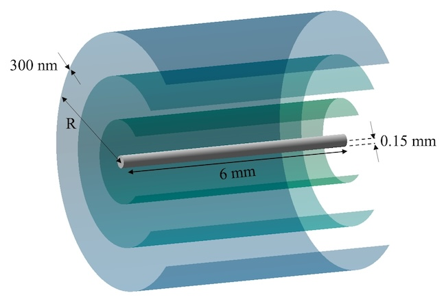

# DaRT seed simulation

Simulation of a DaRT seed. Seed is surrounded by rings in which the particle distribution is saved. This can be used as the input to the RBE simulation which calculates the DNA damage due to this particle spectrum.



## How to run

The code is run using:

```
./dart -mac INPUT_FILE_NAME.in -out OUTPUT_FILE_NAME  -seed 1
```

The seed can be set to any integer, if not set this defaults to 1.

### Input file
The input file specifies the number of rings, the inner ring radius, the outer ring radius, the primary ion (Ra224 for DaRT) and the number of decays. Rings are evenly spaced between the inner and outer radii.


For example:
```
/run/verbose 1
/control/verbose 2
/det/cellPos_min 155 micrometer
/det/cellPos_max 255 micrometer
/det/cellPos_Nrings 3
/run/initialize
/gun/particle ion
/gun/ion 88 224 0 0
/run/printProgress 20000
/run/beamOn 2000000
```

### Visualisation
To view the geometry
```
./dart -gui -mac INPUT_FILE_NAME.in
```
Ensure the number of events is small, these will be not be shown in the visualisation.